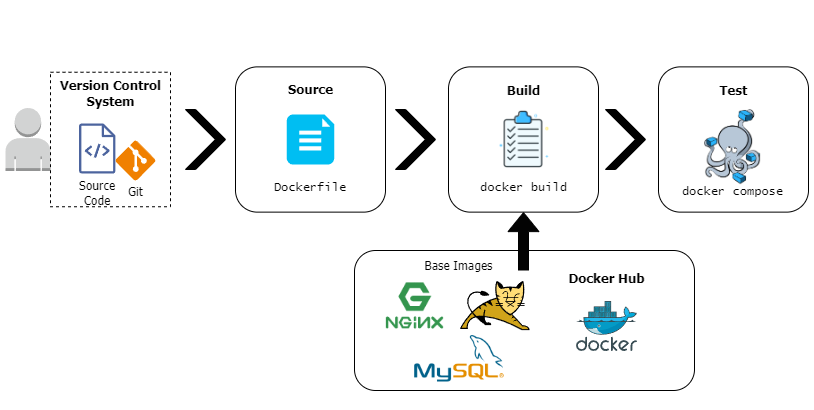

# Deployment of Java Application using Docker Compose in AWS

## General Steps

1. Set up an AWS EC2 Instance

2. Install `Docker Engine`

3. Find the correct base image according to the app services
(check which services require a customised image)

4. Fetch the source code from GitHub

4. Write a customised `Dockerfile` for the required services

5. Write a `docker-compose.yml` file to run multiple containers for the 
app services

6. Perform final tests

## Project Scaffold

* Custom `Dockerfile` for services (separated in different directories)

* `docker-compose.yml`

* `src` directory

* `pom.xml` file

## Architecture



## Initial Settings: AWS EC2 Instance

To build and deploy the application, I launched an EC2 instance in AWS with 
the following specifications:

* Name: `build-vprofile-docker`

* AMI: `Ubuntu Server 24.04 LTS`

* Type: `t2.small`

* RSA Key-pair generated as a `.pem` file

* Security group: Inbound rule

  - Type: All traffic

  - Source: My IP

I accessed the EC2 instance using Git Bash:

`ssh -i [key-pair-name].pem ubuntu@[public-ip-address]`

Once inside the EC2 instance, I ran `sudo apt update` and checked the 
specifications using `cat /etc/os-release`:

```
$ cat /etc/os-release
PRETTY_NAME="Ubuntu 24.04 LTS"
NAME="Ubuntu"
VERSION_ID="24.04"
VERSION="24.04 LTS (Noble Numbat)"
VERSION_CODENAME=noble
ID=ubuntu
ID_LIKE=debian
HOME_URL="https://www.ubuntu.com/"
SUPPORT_URL="https://help.ubuntu.com/"
BUG_REPORT_URL="https://bugs.launchpad.net/ubuntu/"
PRIVACY_POLICY_URL="https://www.ubuntu.com/legal/terms-and-policies/privacy-policy"
UBUNTU_CODENAME=noble
LOGO=ubuntu-logo
```

## Install Docker Engine

I followed the steps to install Docker Engine for Ubuntu, as mentioned in the 
[Docker documentation page](https://docs.docker.com/engine/install/), using the 
`apt` repository.

The final step is verifying the installation process by running 
`docker run hello-world`:

```
$ sudo docker run hello-world

Hello from Docker!
This message shows that your installation appears to be working correctly.

To generate this message, Docker took the following steps:
 1. The Docker client contacted the Docker daemon.
 2. The Docker daemon pulled the "hello-world" image from the Docker Hub.
    (amd64)
 3. The Docker daemon created a new container from that image which runs the
    executable that produces the output you are currently reading.
 4. The Docker daemon streamed that output to the Docker client, which sent it
    to your terminal.

To try something more ambitious, you can run an Ubuntu container with:
 $ docker run -it ubuntu bash

Share images, automate workflows, and more with a free Docker ID:
 https://hub.docker.com/

For more examples and ideas, visit:
 https://docs.docker.com/get-started/
```

Finally, I added `docker_user` to the `docker` group:

`sudo usermod -aG docker $USER`

## Find the Base Images for the App Services

I browsed the [Docker Hub webpage](https://hub.docker.com/) and found
the Base Images for the different services, checking the required 
specifications for the application:

* MySQL: https://hub.docker.com/_/mysql

   - Tag: `8.0.33`

   - Version: 8

   - Set environment variables: `MYSQL_ROOT_PASSWORD`, `MYSQL_DATABASE`

   - Initialise a database: `db_backup.sql` by placing it into the 
   `/docker-entrypoint-initdb.d` directory

   - Port: 3306

* Memcached: https://hub.docker.com/_/memcached

   - Port: 11211

* RabbitMQ: https://hub.docker.com/_/rabbitmq

   - Add **user** and **password** with a tag **administrator** by 
   setting `RABBITMQ_DEFAULT_USER` and `RABBITMQ_DEFAULT_PASS` environment
   variables

   - Port: 5672

* Tomcat: 

   - Tag: `9-jre11`

   - Place the artifact inside the container

   - Modify backend details in `applications.properties` file

   - Port: 8080

* Nginx:

   - Replace default config file with the application config file

## Fetch the Source Code from GitHub

### Adding SSH Keys to GitHub

* Run `ssh-keygen -t rsa` to generate private and public keys

* Add the content in `/home/ubuntu/.ssh/id_rsa.pub` to GitHub SSH Keys

### Clone the application repository

Use `git clone` to clone the source code from the author's repository.
The author suggests using the branch `containers`:

`git clone -b containers git@github.com:hkhcoder/vprofile-project.git`

Create the **scaffolding** for the project:

* `Docker-files` directory: Includes the directories where the customised 
docker images for the services are placed:

   - `app`: Contains the `Dockerfile` for the app builder (Maven) 
   and Tomcat

   - `db`: Contains the `Dockerfile` for running the MySQL service 
   with the defined environmental variables and the initial database 
   `db_backup.sql`

   - `web`: Contains the `Dockerfile` for running the Nginx service
   with the specific app configuration

* `src` directory with the Java source code

* `docker-compose.yml` file which contains the instructions for
retrieving the base images, the customised images and building the 
containers

* `pom.xml` file which indicates the artifact details and versions