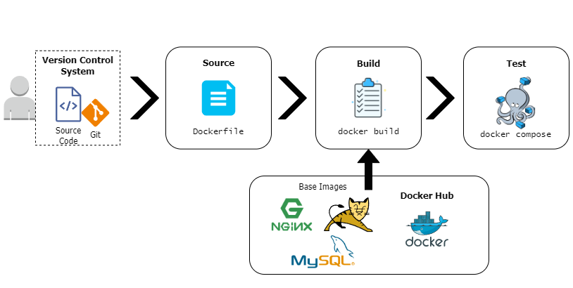
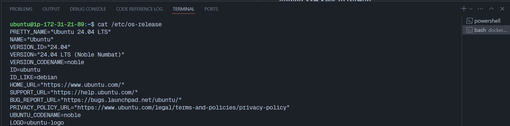
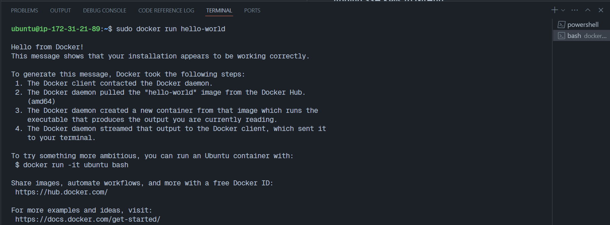
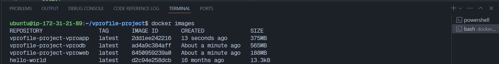
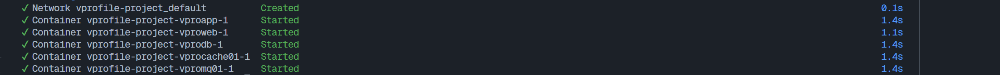
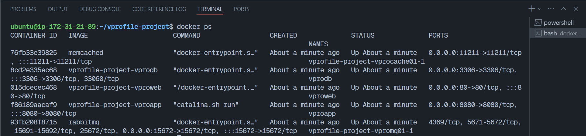
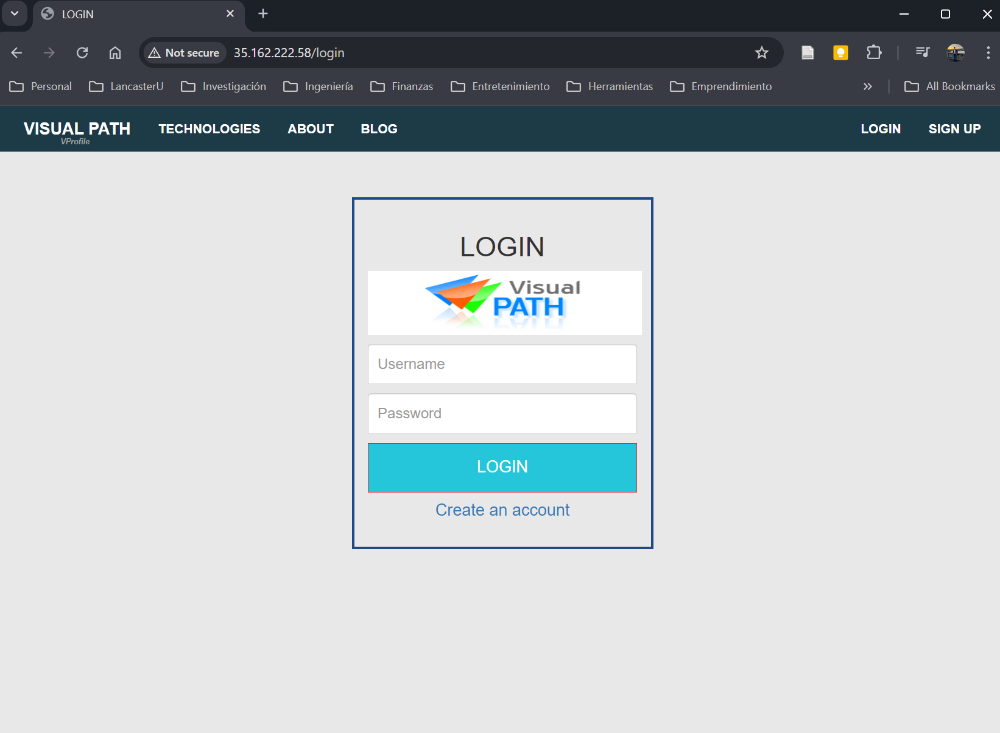

# Deployment of Java Application using Docker Compose in AWS

## General Steps

1. Set up an AWS EC2 Instance

2. Install `Docker Engine`

3. Find the correct base image according to the app services
(check which services require a customised image)

4. Fetch the source code from GitHub

4. Write a customised `Dockerfile` for the required services

5. Write a `docker-compose.yml` file to run multiple containers for the 
app services

6. Perform final tests

## Project Scaffold

* Custom **Dockerfile** for services (separated in different directories)

* **docker-compose.yml** file

* **src**: Directory with Java source code

* **pom.xml**: Contains the application info used by Maven to build the artifact

## Architecture

## Initial Settings: AWS EC2 Instance

To build and deploy the application, I launched an EC2 instance in AWS with 
the following specifications:

* Name: `build-vprofile-docker`

* AMI: `Ubuntu Server 24.04 LTS`

* Type: `t2.small`

* RSA Key-pair generated as a `.pem` file

* Security group: Inbound rule

  - Type: All traffic

  - Source: My IP

I accessed the EC2 instance using Git Bash:

`ssh -i [key-pair-name].pem ubuntu@[public-ip-address]`

Once inside the EC2 instance, I ran `sudo apt update` and checked the 
specifications using `cat /etc/os-release`:

## Install Docker Engine

I followed the steps to install Docker Engine for Ubuntu, as mentioned in the 
[Docker documentation page](https://docs.docker.com/engine/install/), using the 
`apt` repository.

The final step is verifying the installation process by running 
`docker run hello-world`:

$ sudo docker run hello-world

Finally, I added `$USER` to the `docker` group:

`sudo usermod -aG docker $USER`

## Find the Base Images for the App Services

I browsed the [Docker Hub webpage](https://hub.docker.com/) and found
the Base Images for the different services, checking the required 
specifications for the application in 
`/src/main/resources/application.properties`:

* MySQL: https://hub.docker.com/_/mysql

   - Container name: `vprodb`

   - Tag: `8.0.33`

   - Version: 8

   - Set environment variables: `MYSQL_ROOT_PASSWORD`, `MYSQL_DATABASE`

   - Initialise a database: `db_backup.sql` by placing it into the 
   `/docker-entrypoint-initdb.d` directory

   - Port: 3306

* Memcached: https://hub.docker.com/_/memcached

   - Container name: `vprocache01`

   - Port: 11211

* RabbitMQ: https://hub.docker.com/_/rabbitmq
   
   - Container name: `vpromq01`

   - Add **user** and **password** with a tag **administrator** by 
   setting `RABBITMQ_DEFAULT_USER` and `RABBITMQ_DEFAULT_PASS` environment
   variables

   - Port: 15672

* Nginx: https://hub.docker.com/_/nginx

   - Container name: `vproweb`

   - Replace default config file with the application config file

* Tomcat: https://hub.docker.com/_/tomcat

   - Tag: `9-jre11`

   - Version: 9 with JDK 11

   - Place the artifact inside the container

   - Modify backend details in `applications.properties` file

   - Port: 8080

* JDK: https://hub.docker.com/_/openjdk

   - Tag: `11`

   - Version: 11

## Prepare the Environment for the Deployment

### Adding SSH Keys to GitHub

* Run `ssh-keygen -t rsa` to generate private and public keys

* Add the content in `/home/ubuntu/.ssh/id_rsa.pub` to GitHub SSH Keys

### Clone the Application Repository

Use `git clone` to clone the source code from the author's repository.
The author suggests using the branch `containers`:

`git clone -b containers git@github.com:devopshydclub/vprofile-project.git`

### Add the Project Scaffold

Add the **SCAFFOLD** for the project:

* **Docker-files/** directory: Includes the directories where the customised 
docker images for the services are placed:

   - **app/**: Create `Dockerfile` to build the Java app using Maven 
   and to place the artifact `.war` Tomcat

   - **db/**: Create `Dockerfile` to run the MySQL service 
   setting environmental variables and the initial database 
   `db_backup.sql`

   - **web/**: Create `Dockerfile` to run the Nginx service
   with the specific app configuration

* **src/** directory

* **docker-compose.yml** file with the instructions for retrieving 
the base images, the customised images and building the containers

* **pom.xml** file

## Create `Dockerfile` and `docker-compose.yml` files

* Create the custom `Dockerfile` for the services:

   - MySQL

   - Maven (Builder) and Tomcat

   - Nginx

* Create the `docker-compose.yml` file with the instructions to
run the base and custom images.

## Containerise with `docker compose`

In the directory where the `docker-compose.yml` file is located,
run:

* `docker compose build` to build the images

* Check the images list by running `docker images`

* Run the containers in the background: `docker compose up -d`

* Check the running containers: `docker ps`

## Browse the Java Application and "Ta-da!"

Use a browser and the EC2 public IP to open the Java application.

You can test all the services are working by logging in:

* User and password: `admin_vp`

* Inside the admin user, click on the green buttons: 

   - "RabbitMQ": initiates RabbitMQ

   - "All users": Access MySQL database of users and generates the
   cache via Memcached.

## Clean Up

* Use `docker compose down` to stop the containers 

* Use `docker system prune -a` to remove all the containers, images,
networks and cache in the system